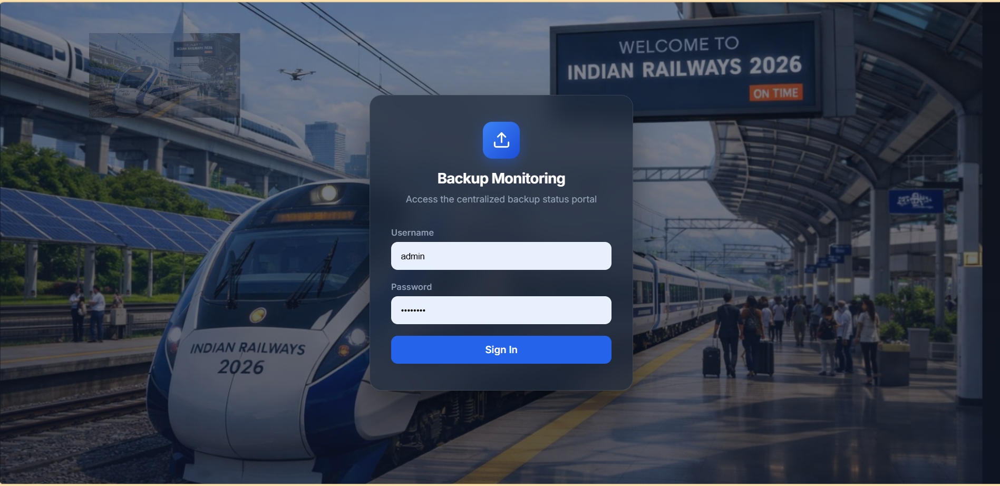
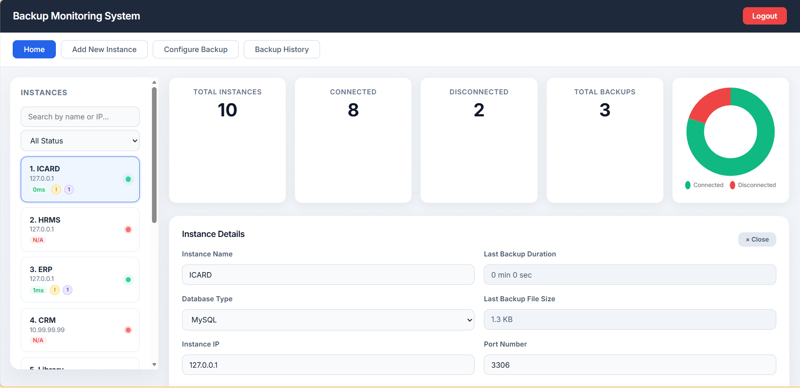
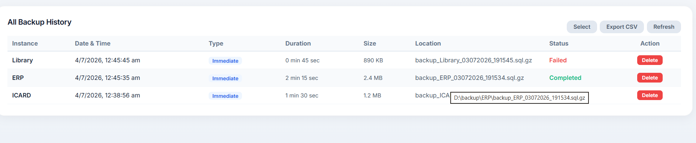
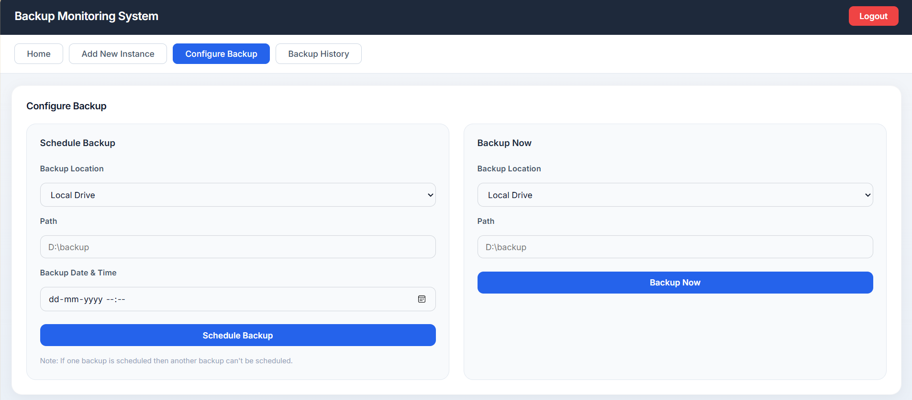
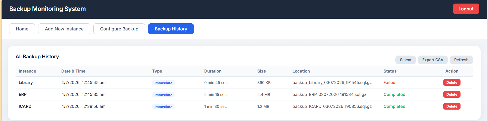
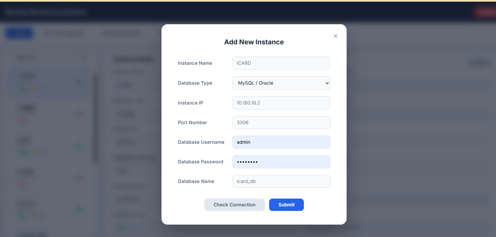

# Backup Monitoring System

A comprehensive full-stack web application for monitoring and managing database backups across multiple instances. Built with Flask, MySQL, and modern web technologies.

## Screenshots

### Login Page


### Dashboard - Home


### Dashboard - Instance Details


### Configure Backup


### Backup History


### Add New Instance


## Overview

The Backup Monitoring System provides a centralized platform to:
- Monitor database instance connectivity with real-time TCP socket checks
- Perform immediate backups with a single click
- Schedule automated backups for future execution
- Track backup history with file sizes, durations, and source computer info
- View detailed instance information with connection diagnostics
- Auto-generate remarks with connection/disconnection reasons (ECONNREFUSED, ETIMEDOUT, etc.)

## Features

### Core Features
- **Instance Management** - Add, view, update, and delete database instances
- **Real-time Monitoring** - Live TCP socket connectivity checks with detailed error codes
- **Connection Diagnostics** - Shows exactly why an instance is connected or disconnected
- **Immediate Backups** - Backup databases on demand to `D:\backup`
- **Scheduled Backups** - Schedule backups at specific dates and times
- **Statistics Dashboard** - Total instances, connected, disconnected, and total backups
- **User Authentication** - Secure login system with username/password
- **Multi-Computer Support** - 5+ computers can backup to one central server

### Connection Diagnostics
When checking or adding an instance, the system shows real socket-level reasons:
| Error Code | Meaning |
|------------|---------|
| ECONNREFUSED | Database service not running on this port |
| ETIMEDOUT | Host not responding, may be powered off |
| EAI_NONAME | DNS lookup failed, invalid IP |
| EHOSTDOWN | Host exists but firewall blocking port |
| ENETUNREACH | No network route to host |
| EACCES | Permission denied |

### Auto-Generated Remarks
- **Connected instances**: "Connected on 24-06-2026 03:45 PM -- MySQL is running and accepting connections on port 3306. Response time: 12ms"
- **Disconnected instances**: "Disconnected on 24-06-2026 03:45 PM -- ECONNREFUSED -- 10.99.99.99:3306. No process is listening on this port."

### Backup Organization
```
D:\backup\
  +-- ERPDB\
  |   +-- backup_ERPDB_24062026_143022.sql
  |   +-- backup_ERPDB_25062026_090015.sql
  +-- CRM\
  |   +-- backup_CRM_24062026_143055.sql
  +-- Library\
  +-- StudentDB\
  +-- Payroll\
```

### Database Support
- MySQL (full support with mysqldump)
- Oracle (placeholder support, expdp integration planned)

## Tech Stack

**Backend:**
- Python 3.13+
- Flask 3.1.3
- PyMySQL (MySQL connector)
- Flask-CORS (cross-origin requests)
- python-dotenv (environment configuration)

**Frontend:**
- HTML5
- CSS3 (custom styling with animations)
- JavaScript (vanilla, no frameworks)
- Google Fonts (Inter font family)

**Database:**
- MySQL 8.0 / MySQL 9.7
- Database: `backup_monitoring`

**Tools:**
- MySQL Workbench (database management)
- mysqldump (database backups)

## Project Structure

```
BackupMonitoringSystem/
+-- app.py                 # Flask backend application
+-- .env                   # Environment configuration (sensitive data)
+-- schema.sql             # Database schema
+-- README.md              # This file
+-- tests/
|   +-- test_app.py        # Unit tests
+-- public/
|   +-- index.html         # Main HTML file
|   +-- script.js          # Frontend JavaScript logic
|   +-- style.css          # Styling
+-- D:\backup\             # Default backup location (auto-created per instance)
```

## Installation & Setup

### Prerequisites
- Python 3.13+
- MySQL Server 8.0+ or MySQL Server 9.7
- Git (optional)

### Step 1: Clone/Download the Project
```bash
cd BackupMonitoringSystem
```

### Step 2: Install Python Dependencies
```bash
pip install flask flask-cors pymysql python-dotenv
```

### Step 3: Configure Database

1. Open MySQL and create the database:
```bash
mysql -u root -p < schema.sql
```

2. Update `.env` file with your MySQL credentials:
```env
DB_HOST=localhost
DB_PORT=3306
DB_USER=root
DB_PASSWORD=your_password
DB_NAME=backup_monitoring
BACKUP_LOCATION=D:\backup
```

### Step 4: Run the Application
```bash
python app.py
```

The application will start on:
- **Local:** http://localhost:5000
- **Network:** http://192.168.x.x:5000

## Default Login Credentials

- **Username:** admin
- **Password:** admin123

## Usage

### Login
1. Open http://localhost:5000
2. Enter username and password
3. Click "Sign In"

### Add a Database Instance
1. Click "Add New Instance" tab
2. Fill in all required fields
3. Click "Check Connection" to verify connectivity with detailed diagnostics
4. Optionally add custom remarks
5. Click "Submit"
6. View the connection reason (connected/disconnected) with auto-generated remark

### Perform a Backup Now
1. Select an instance from the left sidebar
2. Go to "Configure Backup" section
3. Click "Backup Now"
4. Backup file is created in `D:\backup\<InstanceName>\`

### View Statistics
- Dashboard shows: Total Instances, Connected, Disconnected, Total Backups
- Click any stat card to see filtered instance list

## Database Schema

### Users Table
- `id`, `username`, `password`

### Instances Table
- `id`, `name`, `ip`, `port`, `db_type`, `status`
- `last_backup_duration`, `last_backup_size`, `last_backup_remark`
- `last_down_time`, `last_backup_date`, `backup_location`
- `db_user`, `db_password`, `db_name`

### Backups Table
- `id`, `instance_id`, `backup_type`, `location_type`
- `path`, `scheduled_time`, `execution_time`, `status`

## API Endpoints

| Method | Endpoint | Description |
|--------|----------|-------------|
| POST | `/api/login` | User authentication |
| GET | `/api/instances` | Get all instances with live connectivity |
| POST | `/api/instances` | Add new instance with auto-remark |
| PUT | `/api/instances/<id>` | Update instance |
| DELETE | `/api/instances/<id>` | Delete instance |
| POST | `/api/instances/<id>/backup-now` | Immediate backup |
| POST | `/api/instances/<id>/schedule-backup` | Schedule backup |
| POST | `/api/instances/check-connection` | Test connectivity with diagnostics |
| GET | `/api/stats` | Get dashboard statistics |
| GET | `/api/backups` | Get backup history |
| GET | `/api/instances/<id>/backups` | Get backups for specific instance |

## Running Tests

```bash
python -m pytest tests/ -v
```

## Security Notes

### Current Implementation
- Basic authentication with username/password
- SQL parameterization (prevents SQL injection)
- CORS enabled for cross-origin requests
- Input validation and sanitization

### Recommended for Production
1. Hash passwords with bcrypt or werkzeug
2. Implement JWT or session tokens
3. Use HTTPS (SSL/TLS)
4. Add rate limiting to prevent brute force
5. Add audit logging
6. Encrypt stored database credentials

## Troubleshooting

### MySQL Connection Failed
- Verify MySQL is running
- Check `.env` credentials
- Ensure database exists: `backup_monitoring`

### Backup Not Creating Files
- Verify `D:\backup` folder exists and is writable
- Check MySQL user has sufficient permissions
- Ensure `mysqldump` is installed or in PATH

### Port 5000 Already in Use
- Change PORT in `.env` file

## Future Enhancements

- [ ] Backup restore functionality
- [ ] Email notifications for failed backups
- [ ] Performance metrics and graphs
- [ ] Backup compression and encryption
- [ ] Docker containerization
- [ ] AWS S3 integration

---

**Version:** 1.0.0
**Last Updated:** July 1, 2026
**Status:** Working / Production Ready
